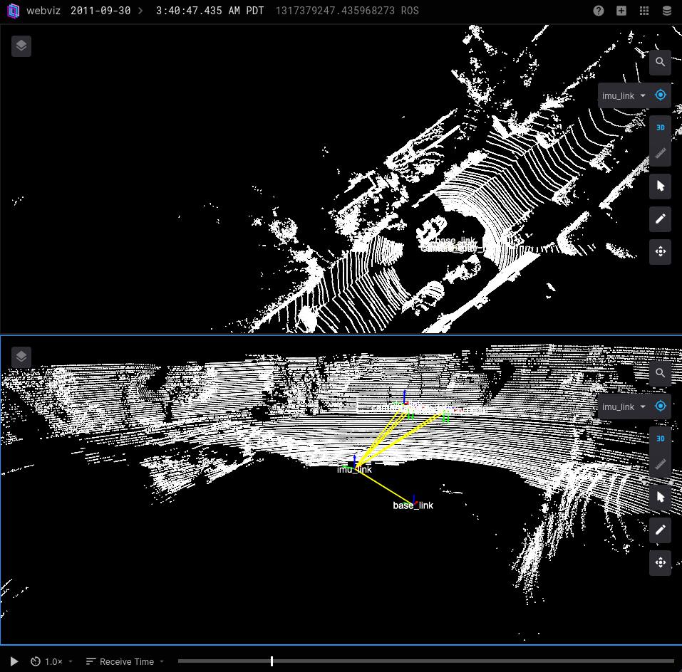

# Toy Implementation of LiDAR SLAM

This project is a toy implementation of LiDAR Slam in Python. In early stage of development.
**This project CANNOT be used in your system.** It is mearly a showcase

### Planned/In Progress
* Optimize pose graph using g2o
* ICP and scan context for loop closure
* Save pointcloud as map?

Here is a screenshot of the LiDAR data as a rosbag, visualized using Webviz

